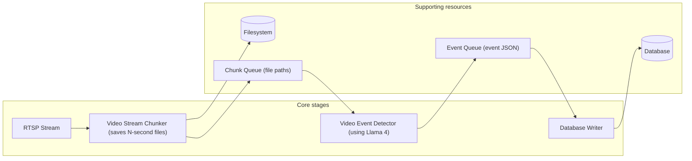
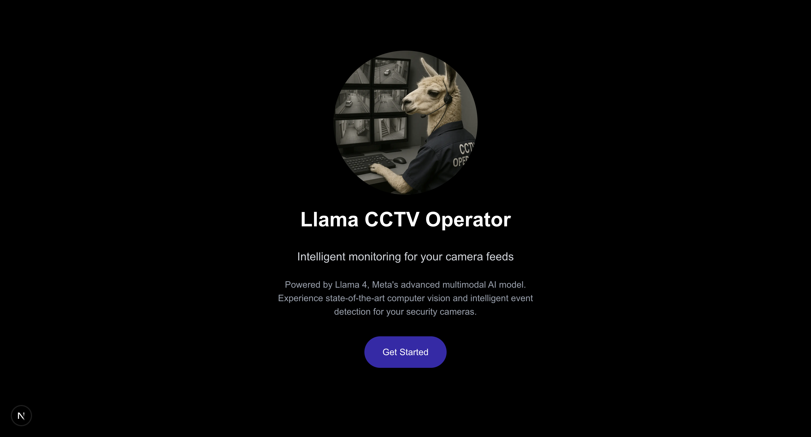
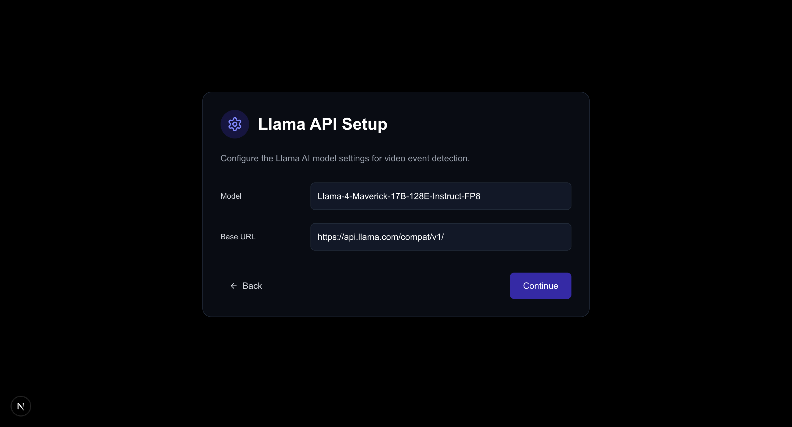
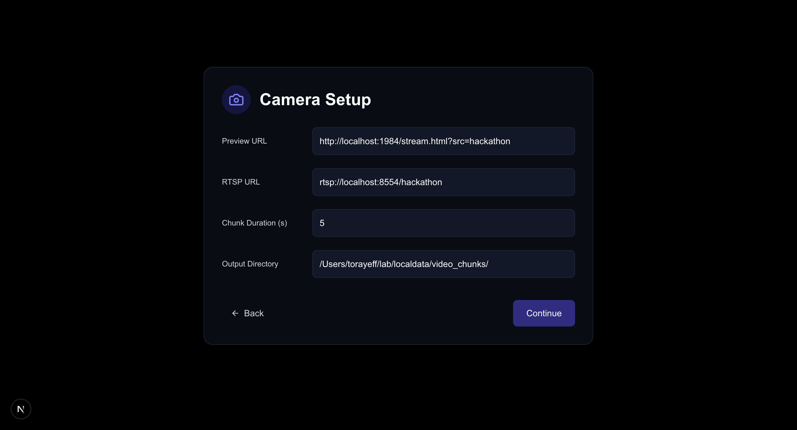
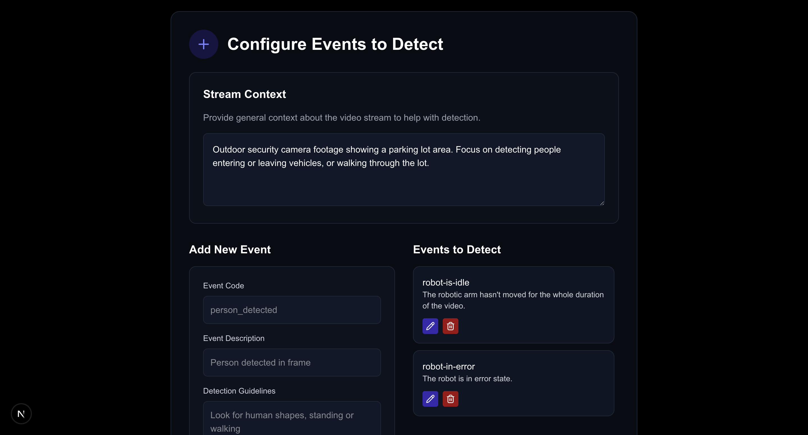
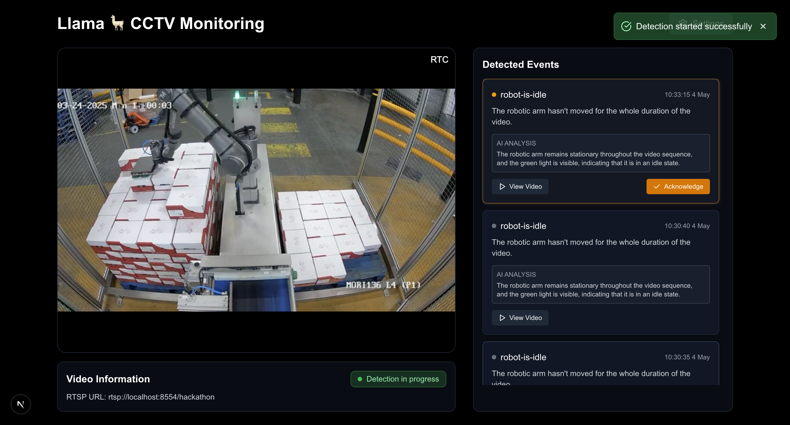

# LlamaCon Hackathon 2025 – San Francisco: AI CCTV Control Room Operator

This project was developed for the LlamaCon Hackathon 2025 in San Francisco. The primary goal was to explore and demonstrate how the multimodal image understanding capabilities of Llama 4 can be applied to a practical use case: assisting CCTV control room operators in identifying predefined video events without requiring any model fine-tuning.

## Project Objectives

1.  Integrate video streams (e.g., RTSP).
2.  Allow users to define specific events to track.
3.  Utilize Llama 4's image analysis to detect these events in video chunks.
4.  Generate real-time alerts for detected events.
5.  Store event data for reporting and analysis.

## Technology Stack

-   **Backend:** Python (FastAPI), LLaMA 4
-   **Frontend:** Next.js

## Architecture

The system processes video streams by chunking them, analyzing chunks for defined events using Llama 4, and storing detected events in a database.

## Application UI

Here's a walkthrough of the user interface:

1.  **Welcome Screen:** The application greets the user and explains its purpose.
    

2.  **Stream Configuration:** Users input the preview and video stream URLs.
    

3.  **Event Definition:** Users define the events they want to monitor by providing an event code, description, and detection guidelines for Llama 4. Multiple events can be added.
    

4.  **Monitoring Dashboard:** This view shows the live video feed (or preview), the list of defined events, and a log of detected events.
    

5.  **Event Detail:** (Assuming step 5 shows event details or similar - update if incorrect) Shows specific details when an event is detected or selected.
    