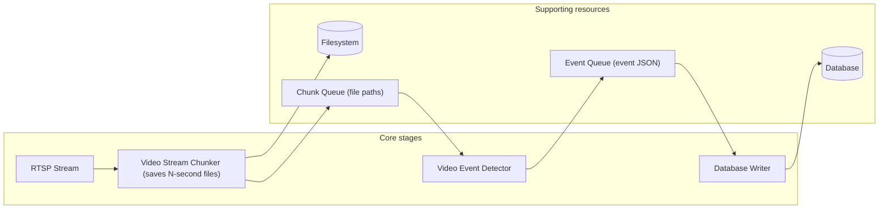

# LlamaCon Hackathon 2025 – San Francisco

## Project Title: ACCRO – AI CCTV Control Room Operator

### Project Objectives
1. Integrate RTSP stream
2. Define and track specific events
3. Generate real-time alerts
4. Compile actionable reports

### Technology Stack
- **Backend:** Python (FastAPI), LLaMA 4  
- **Frontend:** Next.js

### TODO
- [x] Check Llama 4 video capabilities - Max 128k, Max 9 frames at 640x360.
- [x] Test simple video event detection - Kinda works.
- [x] Develop logic for stream
- [x] Develop logic for alerting
- [ ] Implement Video Stream Chunker
- [ ] Implement Database Writer
- [ ] Think about frontend

